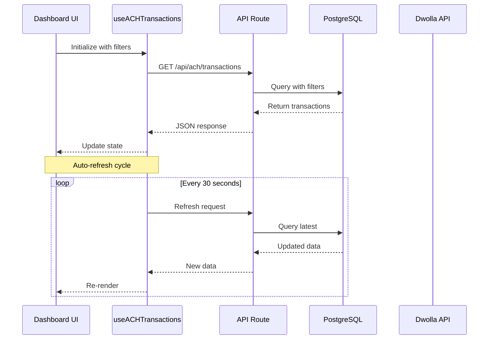
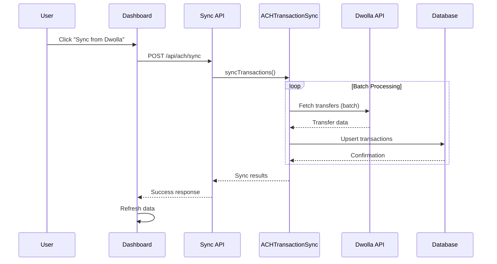

# Billing Dashboard Architecture & Implementation Guide

## Table of Contents
1. [Executive Summary](#executive-summary)
2. [System Architecture](#system-architecture)
3. [Core Components](#core-components)
4. [Data Flow](#data-flow)
5. [Key Features](#key-features)
6. [Technical Implementation](#technical-implementation)
7. [Security Architecture](#security-architecture)
8. [Performance Optimizations](#performance-optimizations)
9. [Development Workflow](#development-workflow)
10. [Best Practices & Patterns](#best-practices--patterns)
11. [Potential Improvements](#potential-improvements)
12. [Troubleshooting Guide](#troubleshooting-guide)

## Executive Summary

The Billing Dashboard is a sophisticated **ACH (Automated Clearing House) payment tracking system** designed specifically to monitor customer-initiated transfers to Cakewalk Benefits. Built on Next.js 14 with TypeScript, it integrates seamlessly with Dwolla's payment platform to provide real-time financial insights and transaction management capabilities.

### Key Capabilities
- **Real-time transaction monitoring** with auto-refresh
- **Comprehensive filtering and search** functionality
- **Batch synchronization** with Dwolla API
- **Advanced metrics and analytics** dashboard
- **Export capabilities** (CSV/Excel)
- **Status tracking and updates**

### Technology Stack
- **Frontend**: Next.js 14, React 19, TypeScript, Tailwind CSS
- **Backend**: Next.js API Routes, Prisma ORM
- **Database**: PostgreSQL
- **Authentication**: NextAuth.js with Google OAuth
- **Payment Integration**: Dwolla API
- **Security**: CSRF protection, rate limiting, session management

## System Architecture

### High-Level Architecture Diagram

```
┌─────────────────────────────────────────────────────────────┐
│                         Frontend Layer                        │
│  ┌─────────────────────────────────────────────────────┐    │
│  │  Billing Dashboard UI (app/billing/page.tsx)        │    │
│  │  - Transaction Table                                │    │
│  │  - Metrics Dashboard                                │    │
│  │  - Filter Controls                                  │    │
│  └─────────────────────────────────────────────────────┘    │
│                              ↓                               │
│  ┌─────────────────────────────────────────────────────┐    │
│  │  Custom Hooks (hooks/use-ach-transactions.ts)       │    │
│  │  - State Management                                 │    │
│  │  - Auto-refresh Logic                               │    │
│  │  - Data Transformation                              │    │
│  └─────────────────────────────────────────────────────┘    │
└─────────────────────────────────────────────────────────────┘
                               ↓
┌─────────────────────────────────────────────────────────────┐
│                          API Layer                           │
│  ┌─────────────────────────────────────────────────────┐    │
│  │  Transaction Routes (app/api/ach/*)                 │    │
│  │  - /transactions - List & filter                    │    │
│  │  - /sync - Sync from Dwolla                        │    │
│  │  - /refresh-statuses - Update statuses             │    │
│  │  - /export - Export to CSV/Excel                   │    │
│  └─────────────────────────────────────────────────────┘    │
│                              ↓                               │
│  ┌─────────────────────────────────────────────────────┐    │
│  │  Middleware Layer                                   │    │
│  │  - Authentication (NextAuth)                        │    │
│  │  - Rate Limiting                                    │    │
│  │  - CSRF Protection                                  │    │
│  └─────────────────────────────────────────────────────┘    │
└─────────────────────────────────────────────────────────────┘
                               ↓
┌─────────────────────────────────────────────────────────────┐
│                       Data Layer                             │
│  ┌─────────────────────────────────────────────────────┐    │
│  │  Database (PostgreSQL + Prisma)                     │    │
│  │  - ACHTransaction Model                             │    │
│  │  - Indexed Queries                                  │    │
│  │  - Transaction History                              │    │
│  └─────────────────────────────────────────────────────┘    │
│                              ↓                               │
│  ┌─────────────────────────────────────────────────────┐    │
│  │  External Integration (Dwolla API)                  │    │
│  │  - Transaction Fetching                             │    │
│  │  - Status Updates                                   │    │
│  │  - Customer Data                                    │    │
│  └─────────────────────────────────────────────────────┘    │
└─────────────────────────────────────────────────────────────┘
                               ↓
┌─────────────────────────────────────────────────────────────┐
│                    Sync Scripts Layer                        │
│  ┌─────────────────────────────────────────────────────┐    │
│  │  Batch Processing (scripts/billing-page-sync.ts)    │    │
│  │  - Scheduled Syncs                                  │    │
│  │  - Manual Imports                                   │    │
│  │  - Data Validation                                  │    │
│  └─────────────────────────────────────────────────────┘    │
└─────────────────────────────────────────────────────────────┘
```

### Component Relationships

The system follows a clear separation of concerns with distinct layers:

1. **Presentation Layer**: React components for UI rendering
2. **State Management Layer**: Custom hooks for data fetching and caching
3. **API Layer**: RESTful endpoints with business logic
4. **Data Access Layer**: Prisma ORM for database operations
5. **Integration Layer**: Dwolla client for external API calls
6. **Utility Layer**: Sync scripts for batch operations

## Core Components

### 1. Billing Dashboard Page (`app/billing/page.tsx`)

The main dashboard component orchestrates the entire billing interface:

```typescript
// Key responsibilities:
- Session authentication verification
- Filter state management
- Transaction data display
- Export functionality
- Sync triggering
- Modal management for transaction details
```

**Key Features:**
- **Auto-refresh**: Configurable polling interval (default: 30 seconds)
- **Pagination**: Server-side pagination with 50 items per page
- **Filter persistence**: Maintains filter state across refreshes
- **Responsive design**: Mobile-friendly layout

### 2. ACH Transactions Hook (`hooks/use-ach-transactions.ts`)

Custom React hook managing data fetching and state:

```typescript
interface UseACHTransactionsReturn {
  transactions: any[]
  metrics: TransactionMetrics
  isLoading: boolean
  error: string | null
  refresh: () => Promise<void>
  lastUpdated: Date
  totalCount: number
  currentPage: number
  totalPages: number
}
```

**Implementation Details:**
- **Optimistic updates**: Immediate UI feedback
- **Error recovery**: Automatic retry on failure
- **Cache invalidation**: Smart refresh strategies
- **Memory management**: Cleanup on unmount

### 3. Billing Metrics Component (`components/billing/BillingMetrics.tsx`)

Displays seven key performance indicators:

```typescript
interface BillingMetrics {
  totalVolume: number      // Sum of all transactions
  successRate: number      // Percentage of successful transactions
  pendingAmount: number    // Transactions in progress
  failedAmount: number     // Failed transaction total
  todayCount: number       // Today's transaction count
  averageTransaction: number // Mean transaction value
  processedAmount: number  // Successfully completed
  returnedAmount: number   // Returned/reversed
  totalFees: number        // Transaction fees
  netAmount: number        // Total minus fees
}
```

**Design Patterns:**
- **Skeleton loading**: Graceful loading states
- **Error boundaries**: Isolated component failures
- **Responsive grid**: Adaptive layout system

### 4. Transaction Table Component (`components/billing/TransactionTable.tsx`)

Displays transaction data in a sortable, filterable table:

**Features:**
- Column sorting
- Status indicators with color coding
- Click-through to transaction details
- Responsive mobile view
- Bulk selection (prepared for future features)

### 5. Billing Filters Component (`components/billing/BillingFilters.tsx`)

Comprehensive filtering system:

```typescript
interface BillingFilterValues {
  dateRange: {
    start: Date | null
    end: Date | null
    preset: string
  }
  status: string[]
  amountRange: {
    min: number | null
    max: number | null
  }
  direction: "all" | "credit" | "debit"
  searchQuery: string
}
```

**Filter Capabilities:**
- Date range selection with presets
- Multi-select status filtering
- Amount range filtering
- Text search across multiple fields
- Collapsible UI for space efficiency

## Data Flow

### 1. Transaction Fetch Flow



### 2. Sync Flow



## Key Features

### 1. Unidirectional Transaction Filter

The system exclusively shows **customer-initiated transfers** (credits to Cakewalk):

```typescript
// app/api/ach/transactions/route.ts
where.direction = "credit"  // Only incoming payments
```

**Rationale:**
- **Security**: Prevents accidental exposure of outbound transfers
- **Clarity**: Focused view on receivables
- **Performance**: Reduced query complexity

### 2. Real-Time Status Updates

Two mechanisms for status synchronization:

#### Full Sync
```typescript
// Comprehensive data pull from Dwolla
POST /api/ach/sync
{
  "limit": 100,
  "startDate": "2024-01-01",
  "endDate": "2024-12-31"
}
```

#### Targeted Status Refresh
```typescript
// Update specific transaction statuses
POST /api/ach/refresh-statuses
{
  "statuses": ["pending", "processing"],
  "limit": 500,
  "concurrency": 5
}
```

### 3. Export Functionality

Supports multiple export formats:

```typescript
// CSV Export
GET /api/ach/export?format=csv&status=processed&startDate=2024-01-01

// Excel Export
GET /api/ach/export?format=excel&direction=credit
```

**Export Features:**
- Filtered exports based on current view
- Large dataset handling
- Automatic filename generation
- Browser download triggering

### 4. Batch Processing System

The sync scripts implement sophisticated batch processing:

```typescript
class BillingPageSync {
  async sync(options: SyncOptions): Promise<SyncStats> {
    // Adaptive batch sizing
    const batchLimit = Math.min(
      options.batchSize,
      options.limit ? options.limit - processedCount : options.batchSize
    )
    
    // Progress tracking
    this.progress.syncedTransactions += results.synced
    this.progress.failedTransactions += results.failed
    
    // Rate limiting protection
    await new Promise(resolve => setTimeout(resolve, 500))
  }
}
```

**Batch Processing Features:**
- Configurable batch sizes (1-1000)
- Progress reporting
- Error recovery
- Memory-efficient streaming
- Rate limit compliance

## Technical Implementation

### Database Schema

```prisma
model ACHTransaction {
  id                  String    @id @default(cuid())
  dwollaId            String    @unique
  status              String
  amount              Decimal   @db.Decimal(15, 2)
  currency            String    @default("USD")
  direction           String    // "credit" or "debit"
  created             DateTime
  lastUpdated         DateTime  @updatedAt
  
  // Source Information
  sourceId            String?
  sourceName          String?
  sourceBankName      String?
  
  // Destination Information
  destinationId       String?
  destinationName     String?
  destinationBankName String?
  
  // Transaction Details
  bankLastFour        String?
  correlationId       String?
  individualAchId     String?
  
  // Customer Information
  customerId          String?
  customerName        String?
  customerEmail       String?
  companyName         String?
  
  // Business Information
  invoiceNumber       String?
  transactionType     String?
  description         String?
  
  // Financial Details
  fees                Decimal?  @db.Decimal(15, 2)
  netAmount           Decimal?  @db.Decimal(15, 2)
  
  // Processing Information
  clearingDate        DateTime?
  processedAt         DateTime?
  failureReason       String?
  failureCode         String?
  
  @@index([status, created])
  @@index([direction, created])
  @@index([customerId])
  @@index([companyName])
}
```

### API Endpoints

#### GET /api/ach/transactions
Lists transactions with filtering and pagination:

**Query Parameters:**
- `page`: Page number (default: 1)
- `limit`: Items per page (default: 50)
- `status`: Filter by status
- `direction`: Filter by direction (always "credit")
- `startDate`: Start date filter
- `endDate`: End date filter
- `minAmount`: Minimum amount filter
- `maxAmount`: Maximum amount filter
- `search`: Text search
- `sortBy`: Sort field
- `sortOrder`: Sort direction

**Response:**
```json
{
  "transactions": [...],
  "pagination": {
    "page": 1,
    "limit": 50,
    "total": 1250,
    "totalPages": 25
  },
  "metrics": {
    "totalAmount": 250000.00,
    "totalCount": 1250,
    "statusCounts": {...},
    "statusAmounts": {...}
  }
}
```

#### POST /api/ach/sync
Triggers synchronization with Dwolla:

**Request Body:**
```json
{
  "limit": 100,
  "startDate": "2024-01-01T00:00:00Z",
  "endDate": "2024-12-31T23:59:59Z",
  "customerId": "optional-customer-id",
  "syncAll": false
}
```

**Response:**
```json
{
  "message": "Sync completed successfully",
  "results": {
    "synced": 95,
    "failed": 5,
    "errors": []
  }
}
```

#### POST /api/ach/refresh-statuses
Updates transaction statuses from Dwolla:

**Request Body:**
```json
{
  "statuses": ["pending", "processing"],
  "limit": 500,
  "concurrency": 5,
  "olderThanDays": 7
}
```

**Response:**
```json
{
  "results": {
    "checked": 100,
    "updated": 15,
    "updatedByStatus": {
      "processed": 12,
      "failed": 3
    }
  }
}
```

## Security Architecture

### Authentication & Authorization

```typescript
// Session validation
const session = await getServerSession(authOptions)
if (!session?.user) {
  return NextResponse.json({ error: "Unauthorized" }, { status: 401 })
}

// Role-based access (prepared for implementation)
// if (session.user.role !== 'admin') {
//   return NextResponse.json({ error: 'Forbidden' }, { status: 403 })
// }
```

### Rate Limiting

```typescript
const syncRateLimiter = createEndpointRateLimiter({
  windowMs: 60 * 1000,  // 1 minute window
  max: 5,                // 5 requests per window
})
```

**Rate Limiting Strategy:**
- **Sync endpoints**: 5 requests per minute
- **Query endpoints**: 100 requests per minute
- **Export endpoints**: 10 requests per minute

### Data Protection

#### Test Data Exclusion
```typescript
const excludedTestCustomerIds = [
  "cust_x5aior80g",
  "cust_npuehcu3i",
  "cust_omdl5p79u",
]

where.NOT = [
  { customerId: { in: excludedTestCustomerIds } },
  { customerId: { startsWith: "cust_" } },
]
```

#### CSRF Protection
- Automatic CSRF tokens on state-changing operations
- Edge Runtime compatible implementation
- Session-based validation

## Performance Optimizations

### 1. Database Optimizations

#### Indexing Strategy
```prisma
@@index([status, created])     // Common filter combination
@@index([direction, created])  // Direction-based queries
@@index([customerId])          // Customer lookups
@@index([companyName])         // Company aggregations
```

#### Query Optimization
```typescript
// Selective field loading
const transactions = await prisma.aCHTransaction.findMany({
  select: {
    id: true,
    amount: true,
    status: true,
    // Only load needed fields
  }
})
```

### 2. Client-Side Optimizations

#### Debounced Search
```typescript
const debouncedSearch = useMemo(
  () => debounce((value: string) => {
    setFilters(prev => ({ ...prev, searchQuery: value }))
  }, 300),
  []
)
```

#### Memoized Calculations
```typescript
const metrics = useMemo(() => {
  return calculateMetrics(transactions)
}, [transactions])
```

### 3. API Optimizations

#### Batch Processing
```typescript
// Process in configurable batches
const BATCH_SIZE = 200
for (let i = 0; i < items.length; i += BATCH_SIZE) {
  const batch = items.slice(i, i + BATCH_SIZE)
  await processBatch(batch)
}
```

#### Concurrent Operations
```typescript
// Parallel status checks
const updates = await Promise.all(
  transactions.map(async (txn) => {
    return updateStatus(txn.dwollaId)
  })
)
```

### 4. Caching Strategy

#### Client-Side Caching
```typescript
// Hook-level caching with auto-invalidation
const [cache, setCache] = useState<Map<string, any>>(new Map())

useEffect(() => {
  const timer = setTimeout(() => {
    setCache(new Map()) // Clear cache after 5 minutes
  }, 5 * 60 * 1000)
  return () => clearTimeout(timer)
}, [])
```

## Development Workflow

### Command Structure

#### Quick Reference
```bash
# Status check
npm run billing:sync:status

# Quick sync (last 7 days)
npm run billing:sync:quick

# Full sync (last 90 days)
npm run billing:sync:full

# Today only
npm run billing:sync:today

# Dry run (test mode)
npm run billing:sync:dry

# Custom sync
npm run tsx scripts/billing-page-sync.ts \
  --start-date 2024-01-01 \
  --end-date 2024-12-31 \
  --limit 1000 \
  --batch-size 100 \
  --verbose
```

### Development Best Practices

#### 1. Local Development Setup
```bash
# Install dependencies
npm install

# Set up environment variables
cp .env.example .env.local
# Edit .env.local with your credentials

# Run database migrations
npx prisma migrate dev

# Start development server
npm run dev
```

#### 2. Testing Workflow
```bash
# Run in dry-run mode first
npm run billing:sync:dry

# Test with small date range
npm run tsx scripts/billing-page-sync.ts \
  --start-date 2024-12-01 \
  --end-date 2024-12-01 \
  --verbose

# Verify in database
npx prisma studio
```

#### 3. Production Deployment
```bash
# Build application
npm run build

# Run production migrations
npx prisma migrate deploy

# Start production server
npm run start
```

### Monitoring & Debugging

#### Logging Strategy
```typescript
logger.info("Starting ACH transaction sync", {
  userId: session.user.id,
  syncOptions,
  timestamp: new Date().toISOString()
})
```

#### Error Tracking
```typescript
try {
  await performOperation()
} catch (error) {
  logger.error("Operation failed", {
    error: error.message,
    stack: error.stack,
    context: { /* relevant data */ }
  })
  throw new ApplicationError("User-friendly message", 500)
}
```

## Best Practices & Patterns

### 1. Error Handling Pattern

```typescript
// Multi-layer error handling
class ApplicationError extends Error {
  constructor(
    message: string,
    public statusCode: number,
    public code?: string
  ) {
    super(message)
  }
  
  toClientResponse() {
    return {
      error: this.message,
      code: this.code
    }
  }
}
```

### 2. Data Validation Pattern

```typescript
// Zod schema validation
const querySchema = z.object({
  page: z.string().transform(val => parseInt(val, 10)),
  limit: z.string().transform(val => parseInt(val, 10)),
  status: z.string().optional(),
  // ... other fields
})

const validated = querySchema.parse(input)
```

### 3. Singleton Pattern for API Clients

```typescript
class DwollaClient {
  private static instance: DwollaClient
  
  static getInstance(): DwollaClient {
    if (!DwollaClient.instance) {
      DwollaClient.instance = new DwollaClient()
    }
    return DwollaClient.instance
  }
}
```

### 4. Repository Pattern for Data Access

```typescript
class ACHTransactionRepository {
  async findByFilters(filters: TransactionFilters) {
    return prisma.aCHTransaction.findMany({
      where: this.buildWhereClause(filters),
      ...this.buildPagination(filters)
    })
  }
  
  private buildWhereClause(filters: TransactionFilters) {
    // Complex query building logic
  }
}
```

## Potential Improvements

### 1. Caching Layer Implementation

#### Redis Integration
```typescript
// Proposed Redis caching
import Redis from 'ioredis'

const redis = new Redis()

async function getCachedTransactions(key: string) {
  const cached = await redis.get(key)
  if (cached) return JSON.parse(cached)
  
  const data = await fetchFromDatabase()
  await redis.setex(key, 300, JSON.stringify(data)) // 5 min cache
  return data
}
```

**Benefits:**
- Reduced database load
- Faster response times
- Session storage
- Metrics aggregation

### 2. Webhook Integration

#### Dwolla Webhook Handler
```typescript
// Proposed webhook endpoint
export async function POST(request: NextRequest) {
  const signature = request.headers.get('x-dwolla-signature')
  const body = await request.json()
  
  if (!verifyWebhookSignature(signature, body)) {
    return NextResponse.json({ error: 'Invalid signature' }, { status: 401 })
  }
  
  switch (body.topic) {
    case 'transfer_completed':
      await handleTransferCompleted(body)
      break
    case 'transfer_failed':
      await handleTransferFailed(body)
      break
  }
  
  return NextResponse.json({ received: true })
}
```

**Benefits:**
- Real-time updates
- Reduced API polling
- Lower latency
- Event-driven architecture

### 3. Advanced Analytics

#### Proposed Analytics Features
```typescript
interface AdvancedMetrics {
  // Velocity metrics
  transactionVelocity: {
    hourly: number[]
    daily: number[]
    weekly: number[]
  }
  
  // Failure analysis
  failurePatterns: {
    byReason: Record<string, number>
    byTimeOfDay: Record<string, number>
    byCustomer: Record<string, number>
  }
  
  // Predictive metrics
  projections: {
    dailyVolume: number
    weeklyVolume: number
    monthlyVolume: number
  }
  
  // Customer insights
  customerMetrics: {
    averageTransactionSize: Record<string, number>
    frequency: Record<string, number>
    lifetime: Record<string, number>
  }
}
```

### 4. Audit Trail System

#### Comprehensive Audit Logging
```typescript
interface AuditLog {
  id: string
  userId: string
  action: string
  resourceType: string
  resourceId: string
  changes: Record<string, any>
  metadata: {
    ip: string
    userAgent: string
    sessionId: string
  }
  timestamp: Date
}

async function logAuditEvent(event: AuditLog) {
  await prisma.auditLog.create({ data: event })
  await notifyAdmins(event) // If critical action
}
```

### 5. Performance Monitoring

#### Application Performance Monitoring (APM)
```typescript
// Proposed APM integration
import * as Sentry from '@sentry/nextjs'

Sentry.init({
  dsn: process.env.SENTRY_DSN,
  tracesSampleRate: 0.1,
  profilesSampleRate: 0.1,
})

// Transaction monitoring
const transaction = Sentry.startTransaction({
  name: 'ACH Sync',
  op: 'sync',
})

try {
  await performSync()
} finally {
  transaction.finish()
}
```

### 6. Multi-tenant Support

#### Tenant Isolation
```typescript
// Proposed multi-tenant architecture
interface TenantContext {
  tenantId: string
  dataIsolation: 'shared' | 'dedicated'
  customSettings: Record<string, any>
}

async function getTenantTransactions(
  tenantId: string,
  filters: TransactionFilters
) {
  return prisma.aCHTransaction.findMany({
    where: {
      ...filters,
      tenantId, // Row-level security
    }
  })
}
```

## Troubleshooting Guide

### Common Issues and Solutions

#### 1. No Transactions Appearing

**Symptoms:**
- Empty transaction table
- Zero metrics

**Solutions:**
```bash
# Check database status
npm run billing:sync:status

# Verify Dwolla connection
npm run tsx scripts/test-dwolla-connection.ts

# Run manual sync with verbose output
npm run billing:sync:quick --verbose

# Check for test data exclusion
# Ensure customer IDs don't start with "cust_"
```

#### 2. Sync Failures

**Symptoms:**
- Sync button shows error
- Console errors about API failures

**Solutions:**
```bash
# Check rate limiting
# Wait 1 minute between sync attempts

# Use smaller batch sizes
npm run tsx scripts/billing-page-sync.ts --batch-size 50

# Check Dwolla API status
curl https://api.dwolla.com/

# Verify credentials
echo $DWOLLA_KEY
echo $DWOLLA_SECRET
```

#### 3. Performance Issues

**Symptoms:**
- Slow page load
- Timeout errors

**Solutions:**
```bash
# Optimize database
npx prisma db execute --file optimize.sql

# Reduce page size
# In code: Change pageSize from 50 to 25

# Clear old data
npm run tsx scripts/cleanup-old-transactions.ts

# Check indexes
npx prisma db pull
# Verify indexes exist
```

#### 4. Status Not Updating

**Symptoms:**
- Transactions stuck in "pending"
- Old status information

**Solutions:**
```bash
# Force status refresh
# Click "Refresh Statuses" button in UI

# Manual status update
npm run tsx scripts/refresh-transaction-statuses.ts \
  --status pending,processing \
  --force

# Check webhook configuration (if applicable)
```

### Debug Mode

Enable debug logging:

```typescript
// In .env.local
LOG_LEVEL=debug
DEBUG=billing:*

// In code
if (process.env.LOG_LEVEL === 'debug') {
  console.debug('Detailed debug info', {
    filters,
    query,
    results
  })
}
```

### Database Queries

Useful database queries for troubleshooting:

```sql
-- Check transaction counts by status
SELECT status, COUNT(*) as count, SUM(amount) as total
FROM "ACHTransaction"
WHERE direction = 'credit'
GROUP BY status;

-- Find stuck transactions
SELECT * FROM "ACHTransaction"
WHERE status IN ('pending', 'processing')
AND created < NOW() - INTERVAL '7 days';

-- Customer transaction summary
SELECT 
  "customerEmail",
  COUNT(*) as transaction_count,
  SUM(amount) as total_amount,
  AVG(amount) as avg_amount
FROM "ACHTransaction"
WHERE direction = 'credit'
GROUP BY "customerEmail"
ORDER BY total_amount DESC;

-- Daily transaction volumes
SELECT 
  DATE(created) as date,
  COUNT(*) as count,
  SUM(amount) as volume
FROM "ACHTransaction"
WHERE direction = 'credit'
GROUP BY DATE(created)
ORDER BY date DESC
LIMIT 30;
```

## Conclusion

The Billing Dashboard represents a well-architected, production-ready system for managing ACH transactions. It demonstrates:

- **Robust Architecture**: Clear separation of concerns with scalable design
- **Security First**: Multiple layers of protection and data validation
- **Performance Optimized**: Efficient queries, caching strategies, and batch processing
- **Developer Friendly**: Comprehensive tooling and clear documentation
- **Business Focused**: Tailored specifically for customer payment tracking

The system successfully balances complexity with maintainability, providing a solid foundation for financial operations while remaining extensible for future requirements.

---

*Document Version: 1.0*  
*Last Updated: January 2025*  
*Author: System Architecture Analysis*
