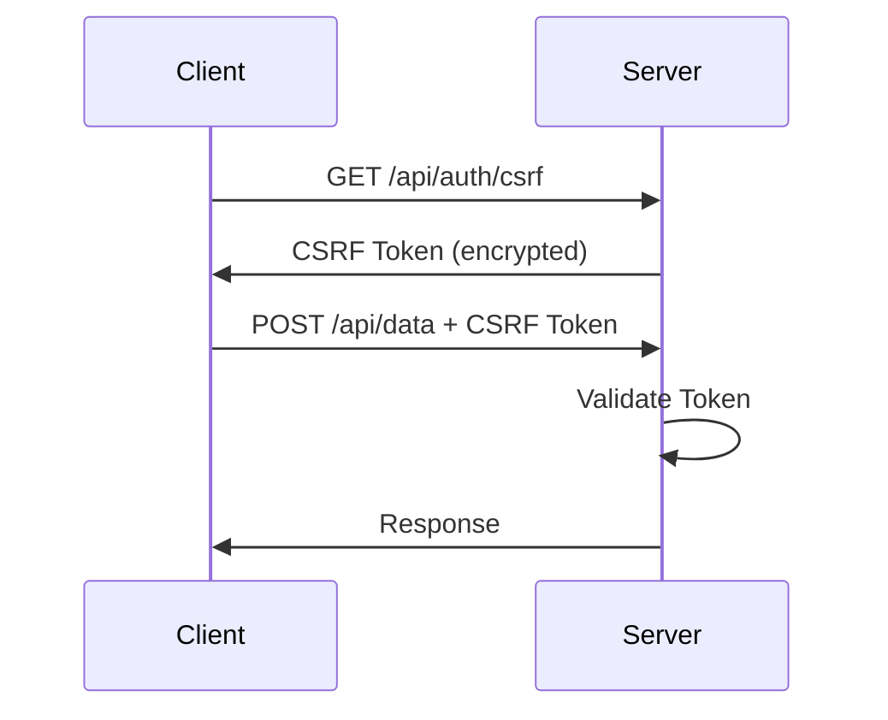

# Security Documentation - Unified Customer Dashboard

## Table of Contents

1. [Overview](#overview)
2. [Security Architecture](#security-architecture)
3. [Authentication & Authorization](#authentication--authorization)
4. [CSRF Protection](#csrf-protection)
5. [Rate Limiting](#rate-limiting)
6. [Multi-Factor Authentication (MFA)](#multi-factor-authentication-mfa)
7. [Session Management](#session-management)
8. [Account Security](#account-security)
9. [Data Protection](#data-protection)
10. [Security Headers](#security-headers)
11. [Audit Logging](#audit-logging)
12. [Security Best Practices](#security-best-practices)
13. [Incident Response](#incident-response)
14. [Compliance](#compliance)

## Overview

This document outlines the security measures implemented in the Unified Customer Dashboard to protect sensitive financial and insurance data. Our security approach follows defense-in-depth principles with multiple layers of protection.

### Security Principles

- **Zero Trust**: Never trust, always verify
- **Least Privilege**: Minimal access rights for users and systems
- **Defense in Depth**: Multiple security layers
- **Secure by Default**: Security enabled out of the box
- **Audit Everything**: Comprehensive logging of security events

## Security Architecture

```
┌─────────────────────────────────────────────────────────────┐
│                        Client Browser                         │
├─────────────────────────────────────────────────────────────┤
│                    Security Headers (CSP)                     │
├─────────────────────────────────────────────────────────────┤
│                      HTTPS (TLS 1.3)                         │
├─────────────────────────────────────────────────────────────┤
│                    Rate Limiting Layer                        │
├─────────────────────────────────────────────────────────────┤
│                    CSRF Protection Layer                      │
├─────────────────────────────────────────────────────────────┤
│              Authentication (NextAuth + MFA)                  │
├─────────────────────────────────────────────────────────────┤
│                  Authorization (RBAC)                         │
├─────────────────────────────────────────────────────────────┤
│                   Application Logic                           │
├─────────────────────────────────────────────────────────────┤
│                 Encrypted Database (AES-256)                  │
└─────────────────────────────────────────────────────────────┘
```

## Authentication & Authorization

### Google OAuth Integration

- **Provider**: Google OAuth 2.0
- **Access Control**: Invite-only email whitelist
- **Session Duration**: 30 minutes with automatic timeout
- **Token Storage**: Secure HTTP-only cookies

### User Roles (RBAC)

| Role | Permissions | Use Case |
|------|-------------|----------|
| ADMIN | Full system access, user management | System administrators |
| SUPPORT | View/search customer data, export reports | Support team members |
| TECHNICAL_SUPPORT | Extended data access, debug tools | Technical support staff |
| USER | Basic read-only access | General users |

### Implementation

```typescript
// Protecting API routes
import { withAuth } from '@/lib/auth/middleware'

export const GET = withAuth(
  async (request, { user }) => {
    // User is authenticated and authorized
    if (user.role !== 'ADMIN') {
      return new Response('Forbidden', { status: 403 })
    }
    // Handle request
  },
  { requiredRole: 'ADMIN' }
)
```

## CSRF Protection

### Dual-Mode Protection

1. **Web Applications**: Token-based CSRF protection
2. **API Clients**: HMAC signature validation

### Web Token Flow



### API Signature Validation

Required headers for API requests:
- `X-API-Key`: Client API key
- `X-Request-Signature`: HMAC-SHA256 signature
- `X-Timestamp`: Request timestamp (±5 minutes)
- `X-Body-Hash`: SHA256 hash of request body

Signature format:
```
HMAC-SHA256(apiKey, "METHOD:PATH:TIMESTAMP:BODY_HASH")
```

### CSRF-Exempt Endpoints

- `/api/auth/*` - Handled by NextAuth
- `/api/health` - Health checks
- Static assets

## Rate Limiting

### Configuration

| Endpoint | Limit | Window | Burst Allowed |
|----------|-------|---------|---------------|
| Global | 60 req/min | 1 minute | Yes (150%) |
| Authentication | 5 attempts | 15 minutes | No |
| API | 100 req/min | 1 minute | Yes |
| Search | 30 req/min | 1 minute | Yes |

### Burst Handling

- Allows temporary bursts up to 150% of limit
- Exponential backoff for continued bursts
- Automatic lockout after 10 violations/hour

### Rate Limit Headers

```
RateLimit-Limit: 60
RateLimit-Remaining: 45
RateLimit-Reset: 2025-01-18T12:00:00Z
Retry-After: 30 (on 429 responses)
```

## Multi-Factor Authentication (MFA)

### TOTP Implementation

- **Algorithm**: TOTP (RFC 6238)
- **Secret Length**: 32 bytes
- **Code Length**: 6 digits
- **Time Window**: 30 seconds
- **Tolerance**: ±1 window

### Security Features

1. **No Secret Exposure**: Only QR codes shown to users
2. **Backup Codes**: 10 single-use recovery codes
3. **Fresh Session Required**: Re-authentication for sensitive operations
4. **Rate Limiting**: 3 attempts per 15-minute window

### MFA Setup Flow

```typescript
// 1. Generate MFA setup
POST /api/auth/mfa/setup
Response: { qrCode, backupCodes, warning }

// 2. Enable MFA
POST /api/auth/mfa/enable
Body: { code: "123456" }

// 3. Verify during login
POST /api/auth/mfa/verify
Body: { code: "123456", sessionToken }
```

### Backup Code Security

- Generated using cryptographically secure random bytes
- Hashed with bcrypt before storage
- Single-use with usage tracking
- Format: `XXXX-XXXX-XXXX` (alphanumeric)

## Session Management

### Session Security Features

1. **Concurrent Session Limit**: 3 active sessions per user
2. **Device Fingerprinting**: Track device characteristics
3. **Anomaly Detection**: 
   - New device detection
   - New location alerts
   - Impossible travel detection
   - Concurrent session monitoring

### Anomaly Severity Levels

| Anomaly | Severity | Action |
|---------|----------|---------|
| New IP Address | Low | Log only |
| New Device | Medium | Email notification |
| Impossible Travel | High | Require MFA re-verification |
| Session Hijacking | Critical | Immediate revocation |

### Session API

```typescript
// Get active sessions
GET /api/auth/sessions

// Revoke specific session
DELETE /api/auth/sessions/:id

// Logout everywhere
DELETE /api/auth/sessions/all
```

## Account Security

### Password Policy

- Minimum 12 characters
- Complexity requirements enforced
- Password history (last 5)
- Force change every 90 days (configurable)
- No common passwords (NIST list)

### Account Lockout

- **Threshold**: 5 failed attempts
- **Lockout Duration**: 30 minutes
- **Reset Window**: 15 minutes
- **Escalation**: 10+ violations → security team notification

### Login Tracking

All login attempts are tracked with:
- Timestamp
- IP address
- User agent
- Success/failure status
- Failure reason

## Data Protection

### Encryption at Rest

- **Database**: AES-256-GCM encryption
- **File Storage**: Encrypted S3 buckets
- **Backup**: Encrypted with separate keys

### Encryption in Transit

- **TLS Version**: 1.3 minimum
- **Cipher Suites**: ECDHE-RSA-AES256-GCM-SHA384
- **HSTS**: Enabled with preload

### PII Protection

- Account numbers masked (last 4 digits only)
- SSN/TIN never stored
- Email addresses hashed for lookups
- Audit logs sanitized

## Security Headers

### HTTP Security Headers

```typescript
{
  'Strict-Transport-Security': 'max-age=31536000; includeSubDomains; preload',
  'X-Frame-Options': 'DENY',
  'X-Content-Type-Options': 'nosniff',
  'X-XSS-Protection': '1; mode=block',
  'Referrer-Policy': 'strict-origin-when-cross-origin',
  'Permissions-Policy': 'geolocation=(), microphone=(), camera=()',
  'X-DNS-Prefetch-Control': 'off',
  'X-Permitted-Cross-Domain-Policies': 'none'
}
```

### Content Security Policy

```
default-src 'self';
script-src 'self' 'unsafe-inline' 'unsafe-eval' https://apis.google.com;
style-src 'self' 'unsafe-inline';
img-src 'self' data: https:;
font-src 'self';
connect-src 'self' https://api.hubapi.com https://api.dwolla.com;
frame-ancestors 'none';
form-action 'self';
base-uri 'self';
```

## Audit Logging

### Logged Events

- Authentication (success/failure)
- Authorization decisions
- Data access (search, view, export)
- Configuration changes
- Security events (lockouts, MFA changes)
- Administrative actions

### Log Format

```json
{
  "id": "uuid",
  "timestamp": "2025-01-18T12:00:00Z",
  "userId": "user-123",
  "action": "SEARCH_CUSTOMER",
  "resource": "customer",
  "resourceId": "cust-456",
  "ipAddress": "192.168.1.1",
  "userAgent": "Mozilla/5.0...",
  "metadata": {
    "searchType": "email",
    "query": "user@example.com"
  },
  "correlationId": "req-789",
  "success": true
}
```

### Log Retention

- **Security Logs**: 2 years
- **Access Logs**: 1 year
- **Debug Logs**: 30 days
- **Compliance**: Follows financial industry standards

## Security Best Practices

### Development Guidelines

1. **Input Validation**: Always validate and sanitize user input
2. **Output Encoding**: Encode data before rendering
3. **Parameterized Queries**: Never concatenate SQL
4. **Secure Dependencies**: Regular vulnerability scanning
5. **Secrets Management**: Use environment variables
6. **Code Reviews**: Security-focused peer reviews

### Deployment Security

1. **Environment Isolation**: Separate dev/staging/prod
2. **Secrets Rotation**: Quarterly key rotation
3. **Vulnerability Scanning**: Weekly automated scans
4. **Penetration Testing**: Annual third-party assessment
5. **Security Updates**: Critical patches within 24 hours

### API Security

1. **Authentication**: All endpoints require authentication
2. **Rate Limiting**: Applied to all endpoints
3. **Input Validation**: JSON schema validation
4. **Error Handling**: Generic error messages
5. **Monitoring**: Real-time anomaly detection

## Incident Response

### Incident Classification

| Level | Description | Response Time | Example |
|-------|-------------|---------------|---------|
| P1 | Critical security breach | < 15 minutes | Data breach, system compromise |
| P2 | High security risk | < 1 hour | Suspicious activity, failed auth spike |
| P3 | Medium security concern | < 4 hours | Policy violation, unusual patterns |
| P4 | Low security issue | < 24 hours | Configuration drift, minor anomaly |

### Response Procedures

1. **Detection**: Automated monitoring and alerting
2. **Triage**: Assess severity and impact
3. **Containment**: Isolate affected systems
4. **Investigation**: Root cause analysis
5. **Remediation**: Fix vulnerabilities
6. **Recovery**: Restore normal operations
7. **Post-Mortem**: Document lessons learned

### Contact Information

- **Security Team**: security@company.com
- **On-Call**: +1-XXX-XXX-XXXX
- **Escalation**: ciso@company.com

## Compliance

### Standards & Frameworks

- **SOC 2 Type II**: Annual certification
- **PCI DSS**: Level 2 compliance
- **GDPR**: Privacy by design
- **CCPA**: California privacy rights
- **HIPAA**: Healthcare data protection

### Regular Assessments

- **Vulnerability Scans**: Weekly automated
- **Penetration Testing**: Annual third-party
- **Code Analysis**: Daily SAST/DAST
- **Compliance Audits**: Quarterly internal
- **Risk Assessments**: Semi-annual

### Data Governance

1. **Classification**: Public, Internal, Confidential, Restricted
2. **Retention**: Based on legal requirements
3. **Deletion**: Secure data destruction
4. **Access Control**: Need-to-know basis
5. **Data Minimization**: Collect only necessary data

## Security Monitoring

### Real-Time Monitoring

- Failed authentication attempts
- Unusual access patterns
- API abuse detection
- Session anomalies
- Configuration changes

### Alerting Thresholds

| Metric | Warning | Critical |
|--------|---------|----------|
| Failed Logins | 10/hour | 50/hour |
| API Errors | 5% | 10% |
| Response Time | 3s | 5s |
| Concurrent Sessions | 100 | 200 |

### Security Dashboards

1. **Executive Dashboard**: High-level security posture
2. **Operations Dashboard**: Real-time threat monitoring
3. **Compliance Dashboard**: Audit and compliance status
4. **User Activity Dashboard**: Access patterns and anomalies

## Security Testing

### Automated Testing

```bash
# Run security tests
npm run test:security

# OWASP dependency check
npm audit

# Security linting
npm run lint:security
```

### Manual Testing Checklist

- [ ] Authentication bypass attempts
- [ ] Session fixation tests
- [ ] CSRF token validation
- [ ] Rate limit effectiveness
- [ ] Input validation (XSS, SQLi)
- [ ] Access control verification
- [ ] Error message information leakage
- [ ] Security header presence

## Emergency Procedures

### Security Breach Response

1. **Immediate Actions**:
   - Isolate affected systems
   - Revoke compromised credentials
   - Enable emergency lockdown mode
   - Notify security team

2. **Investigation**:
   - Preserve evidence
   - Analyze logs
   - Identify attack vector
   - Assess data exposure

3. **Communication**:
   - Internal stakeholders
   - Legal counsel
   - Affected customers
   - Regulatory bodies (if required)

### Emergency Contacts

- **Security Hotline**: +1-XXX-XXX-XXXX
- **Legal Team**: legal@company.com
- **PR Team**: pr@company.com
- **Executive Team**: Use escalation matrix

---

**Last Updated**: January 18, 2025  
**Version**: 1.0  
**Owner**: Security Team  
**Review Cycle**: Quarterly